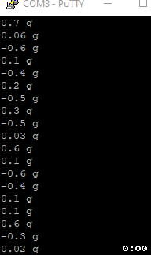

# hx711-pico-c

This is my implementation of reading from a HX711 via a Raspberry Pi Pico. It uses the RP2040's PIO feature to be as efficient as possible.

## Clone Repository
```console
git clone https://github.com/endail/hx711-pico-c
```

After building, copy `main.uf2` in the build directory to the Raspberry Pi Pico and then open up a serial connection to the Pico at a baud rate of 115200.

I have used [this helpful tutorial](https://paulbupejr.com/raspberry-pi-pico-windows-development/) to setup my Windows environment in order to program the Pico via Visual Studio Code.



The .gif above illustrates the [current example code](main.c) obtaining data from a HX711 operating at 80 samples per second. Each line shows the current weight calculated from all samples obtained within 250 milliseconds, along with the minimum and maximum weights of the scale since boot. I applied pressure to the load cell to show the change in weight.

You do not need to use or `#include` the scale functionality if you only want to use the HX711 functions.

## How to Use HX711

1. Initialise the HX711

See [here](https://learn.adafruit.com/assets/99339) for a pinout to choose GPIO pins.

```c
#include "include/hx711.h"
#include "hx711_noblock.pio.h" // for hx711_noblock_program and hx711_noblock_program_init

hx711_t hx;

hx711_init(
    &hx,
    clkPin, // GPIO pin
    datPin, // GPIO pin
    pio0, // the RP2040 PIO to use
    &hx711_noblock_program, // the state machine program
    &hx711_noblock_program_init); // the state machine program init function
```

2. Power up

```c
hx711_set_power(&hx, hx711_pwr_up);
```

3. Set gain

```c
hx711_set_gain(&hx, hx711_gain_128);
```

4. Wait for readings to settle

```c
hx711_wait_settle(hx711_rate_10); // or hx711_rate_80 depending on your chip's config
```

5. Read values

```c
int32_t val;

// block until a value is read
val = hx711_get_value(&hx);

// or use a timeout
// #include "pico/time.h" to use make_timeout_time_ms and make_timeout_time_us functions
absolute_time_t timeout = make_timeout_time_ms(250);

bool ok = hx711_get_value_timeout(
    &hx,
    &timeout,
    &val);

if(ok) {
    // value was obtained within the timeout period
    printf("%li\n", val);
}
```

## How to Use Scale

1. Initialise the HX711 as described above from steps 1 - 4

2. Initialise the scale.

```c
#include "include/scale.h"

scale_t sc;

// the values obtained when calibrating the scale
// if you don't know them, read the following section How to Calibrate
mass_unit_t scaleUnit = mass_g;
int32_t refUnit = -432;
int32_t offset = -367539;

scale_init(
    &sc,
    &hx,
    scaleUnit,
    refUnit,
    offset);
```

3. Set options for how the scale will read and interpret values

```c
// SCALE_DEFAULT_OPTIONS will give some default settings which you
// do not have to use
scale_options_t opt = SCALE_DEFAULT_OPTIONS;

// scale_options_t has the following options
//
// opt.strat, which defines how the scale will collect data. By default,
// data is collected according to the number of samples. So opt.strat
// is set to strategy_type_samples. opt.samples defines how many samples
// to obtain. You can also set opt.strat to read_type_time which will
// collect as many samples as possible within the timeout period. The
// timeout period is defined by opt.timeout and is given in microseconds
// (us). For example, 1 second is equal to 1,000,000 us.
//
// opt.read, which defines how the scale will interpret data. By default,
// data is interpreted according to the median value. So opt.read is set
// to read_type_median. You can also set opt.read to read_type_average
// which will calculate the average value.
//
// Example:
//
// opt.strat = strategy_type_time;
// opt.read = read_type_average;
// opt.timeout = 250000;
//
// These options mean... collect as many samples as possible within 250ms
// and then use the average of all those samples.
```

4. Zero the scale (OPTIONAL) (aka. tare)

```c
if(scale_zero(&sc, &opt)) {
    printf("Scale zeroed successfully\n");
}
else {
    printf("Scale failed to zero\n");
}
```

5. Obtain the weight

```c
mass_t mass;

if(scale_weight(&sc, &mass, &opt)) {

    // mass will contain the weight on the scale obtanined and interpreted
    // according to the given options and be in the unit defined by the
    // mass_unit_t 'scaleUnit' variable above
    //
    // you can now:

    // get the weight as a numeric value according to the mass_unit_t
    double val;
    mass_get_value(&mass, &val);

    // convert the mass to a string
    char buff[MASS_TO_STRING_BUFF_SIZE];
    mass_to_string(&mass, buff);
    printf("%s\n", buff);

    // or do other operations (see: mass.h file)

}
else {
    printf("Failed to read weight\n");
}
```

## How to Calibrate

1. Modify [the calibration program](calibration.c#L68-L75) and change the clock and data pins to those connected to the HX711. Also change the rate at which the HX711 operates if needed.

2. Build.

3. Copy `calibration.uf2` in the build directory to the Raspberry Pi Pico.

4. Open a serial connection to the Pico at a baud rate of 115200 and follow the prompts.
