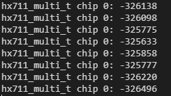

# hx711-pico-c

This is my implementation of reading from a HX711 via a Raspberry Pi Pico. It uses the RP2040's PIO feature to be as efficient as possible. It has two major functions: reading from a [single HX711](#how-to-use-hx711_t) and reading from [multiple HX711s](#how-to-use-hx711_multi_t).

A MicroPython port is available [here](https://github.com/endail/hx711-pico-mpy).

__NOTE__: if you are looking for a method to weigh objects (ie. by using the HX711 as a scale), see [pico-scale](https://github.com/endail/pico-scale).



The .gif above illustrates obtaining data from a single HX711 operating at 80 samples per second.

## Clone Repository

```console
git clone https://github.com/endail/hx711-pico-c
```

Run `cmake` to build the example program. The `.uf2` file you upload to your Pico will be found under `build/tests/`.

Alternatively, include it as a submodule in your project and then `#include "extern/hx711-pico-c/include/common.h"`.

```console
git submodule add https://github.com/endail/hx711-pico-c extern/hx711-pico-c
git submodule update --init
```

## Documentation

[https://endail.github.io/hx711-pico-c](https://endail.github.io/hx711-pico-c/hx711_8h.html)

## How to Use hx711_t

See [here](https://pico.pinout.xyz/) for a pinout to choose two GPIO pins on the Pico (RP2040). One GPIO pin to connect to the HX711's clock pin and a second GPIO pin to connect to the HX711's data pin. You can choose any two pins as the clock and data pins, as long as they are capable of digital output and input respectively.

```c
#include "include/common.h"

// 1. Set configuration
hx711_config_t hxcfg;
hx711_get_default_config(&hxcfg);

hxcfg.clock_pin = 14; //GPIO pin connected to HX711 clock pin
hxcfg.data_pin = 15; //GPIO pin connected to HX711 data pin

//by default, the underlying PIO program will run on pio0
//if you need to change this, you can do:
//hxcfg.pio = pio1;

// 2. Initialise
hx711_init(&hx, &hxcfg);

// 3. Power up the hx711 and set gain on chip
hx711_power_up(&hx, hx711_gain_128);

// 4. This step is optional. Only do this if you want to
// change the gain AND save it to the HX711 chip
//
// hx711_set_gain(&hx, hx711_gain_64);
// hx711_power_down(&hx);
// hx711_wait_power_down();
// hx711_power_up(&hx, hx711_gain_64);

// 5. Wait for readings to settle
hx711_wait_settle(rate);

// 6. Read values
// You can now...

// wait (block) until a value is obtained
printf("blocking value: %li\n", hx711_get_value(&hx));

// or use a timeout
int32_t val;
const uint timeout = 250000; //microseconds
if(hx711_get_value_timeout(&hx, timeout, &val)) {
    // value was obtained within the timeout period
    printf("timeout value: %li\n", val);
}
else {
    printf("value was not obtained within the timeout period\n");
}

// or see if there's a value, but don't block if there isn't one ready
if(hx711_get_value_noblock(&hx, &val)) {
    printf("noblock value: %li\n", val);
}
else {
    printf("value was not present\n");
}

//6. Stop communication with HX711
hx711_close(&hx);
```

## How to Use hx711_multi_t

See [here](https://pico.pinout.xyz/) for a pinout to choose at least two separate GPIO pins on the Pico (RP2040).

* One GPIO pin to connect to __every__ HX711's clock pin.
* One or more __contiguous__ GPIO pins to separately connect to each HX711's data pin.

For example, if you wanted to connect four HX711 chips, you could:

* Connect GPIO pin 9 to each HX711's clock pin; and
* Connect GPIO pins 12, 13, 14, and 15 to each separate HX711's data pin.

See the code example below for how you would set this up. You can choose any pins as the clock and data pins, as long as they are capable of digital output and input respectively.

You can connect up to 32 HX711s, although the Pico (RP2040) will limit you to the available pins.

Note: each chip should use the same sample rate. Using chips with different sample rates will lead to unpredictible results.

```c
#include "../include/common.h"

// 1. Set configuration
hx711_multi_config_t hxmcfg;
hx711_multi_get_default_config(&hxmcfg);
hxmcfg.clock_pin = 9; //GPIO pin connected to each HX711 chip
hxmcfg.data_pin_base = 12; //first GPIO pin used to connect to HX711 data pin
hxmcfg.chips_len = 4; //how many HX711 chips connected

//by default, the underlying PIO programs will run on pio0
//if you need to change this, you can do:
//hxmcfg.pio = pio1;

// 2. Initialise
hx711_multi_t hxm;
hx711_multi_init(&hxm, &hxmcfg);

// 3. Power up the HX711 chips and set gain on each chip
hx711_multi_power_up(&hxm, hx711_gain_128);

// 4. This step is optional. Only do this if you want to
// change the gain AND save it to each HX711 chip
//
// hx711_multi_set_gain(&hxm, hx711_gain_64);
// hx711_multi_power_down(&hxm);
// hx711_wait_power_down();
// hx711_multi_power_up(&hxm, hx711_gain_64);

// 5. Wait for readings to settle
hx711_wait_settle(hx711_gain_128);

// 6. Read values
int32_t arr[hxmcfg.chips_len];

// 6a. wait (block) until values are ready
hx711_multi_get_values(&hxm, arr);

// then print the value from each chip
// the first value in the array is from the HX711
// connected to the first configured data pin and
// so on
for(uint i = 0; i < hxmcfg.chips_len; ++i) {
    printf("hx711_multi_t chip %i: %li\n", i, arr[i]);
}

// 6b. use a timeout
if(hx711_multi_get_values_timeout(&hxm, arr, 250000)) {
    // do something with arr
}

// 6c. or read values asynchronously
hx711_multi_async_start(&hxm);

// do other work while waiting for values...

// use hx711_multi_async_done(&hxm) to check
// if values are ready, then...

hx711_multi_async_get_values(&hxm, arr);

// do something with arr

// 7. Stop communication with all HX711 chips
hx711_multi_close(&hxm);
```

## Notes

### Where is Channel A and Channel B?

Channel A is selectable by setting the gain to 128 or 64. Channel B is selectable by setting the gain to 32.

The HX711 has no option for Channel A at a gain of 32, nor is there an option for Channel B at a gain of 128 or 64. Similarly, the HX711 is not capable of reading from Channel A and Channel B simultaneously. The gain must first be changed.

### What is hx711_wait_settle?

After powering up, the HX711 requires a small "settling time" before it can produce "valid stable output data" (see: HX711 datasheet pg. 3). By calling `hx711_wait_settle()` and passing in the correct data rate, you can ensure your program is paused for the correct settling time. Alternatively, you can call `hx711_get_settling_time()` and pass in a `hx711_rate_t` which will return the number of milliseconds of settling time for the given data rate.

### What is hx711_wait_power_down?

The HX711 requires the clock pin to be held high for at least 60us (60 microseconds) before it powers down. By calling `hx711_wait_power_down()` after `hx711_power_down()` you can ensure the chip is properly powered-down.

### Save HX711 Gain to Chip

By setting the HX711 gain with `hx711_set_gain` and then powering down, the chip saves the gain for when it is powered back up. This is a feature built-in to the HX711.

### Powering up with Unknown or Incorrect Gain

When calling `hx711_power_up()` or `hx711_multi_power_up()` it is assumed that the gain value passed to these functions indicates the [previously saved gain](#save-hx711-gain-to-chip) value in the chip. If the previously saved gain is unknown, you can either:

1. Power up with the gain you want then perform at least one read of the chip (eg. `hx711_get_value()`, `hx711_multi_get_values()`, etc...), and the subsequent reads will have the correct gain; or

2. Power up with any gain and then call `hx711_set_gain()` or `hx711_multi_set_gain()` with the gain you want.

### hx711_close/hx711_multi_close vs hx711_power_down/hx711_multi_power_down

In the example code above, the final statement closes communication with the HX711. This leaves the HX711 in a powered-up state. `hx711_close` and `hx711_multi_close` stops the internal state machines from reading data from the HX711. Whereas `hx711_power_down` and `hx711_multi_power_down` also begins the power down process on a HX711 chip by setting the clock pin high.

### Synchronising Multiple Chips

When using multiple HX711 chips, it is possible they may be desynchronised if not powered up simultaneously. You can use `hx711_multi_sync()` which will power down and then power up all chips together.

### PIO + DMA Interrupt Specifics

When using `hx711_multi_t`, two interrupts are claimed: one for a PIO interrupt and one for a DMA interrupt. By default, `PIO[N]_IRQ_0` and `DMA_IRQ_0` are used, where `[N]` is the PIO index being used (ie. configuring `hx711_multi_t` with `pio0` means the resulting interrupt is `PIO0_IRQ_0` and `pio1` results in `PIO1_IRQ_0`). If you need to change the IRQ _index_ for either PIO or DMA, you can do this when configuring.

```c
hx711_multi_config_t hxmcfg;
hx711_multi_get_default_config(&hxmcfg);
hxmcfg.pio = pio1;
hxmcfg.pio_irq_index = 0; //PIO1_IRQ_0 is claimed
hxmcfg.dma_irq_index = 1; //DMA_IRQ_1 is claimed
```

### Mutex?

Mutex functionality is included and enabled by default to protect the HX711 conversion process. If you are sure you do not need it, define the preprocessor flag `HX711_NO_MUTEX` then recompile.

### Custom PIO Programs

`#include include/common.h` includes the PIO programs I have created for both `hx711_t` and `hx711_multi_t`. Calling `hx711_get_default_config()` and `hx711_multi_get_default_config()` will include those PIO programs in the configurations. If you want to change or use your own PIO programs, set the relevant `hx711_*_config_t` defaults, and do the following:

```c
hx711_config_t hxcfg;
hxcfg.pio_init = my_hx_pio_init_func; // function to setup the PIO
hxcfg.reader_prog = my_pio_program; // pio_program_t*
hxcfg.reader_prog_init = my_pio_program_init_func; // function to setup the PIO program
```

`hxcfg.pio_init` and `hxcfg.pio_prog_init` take a pointer to the `hx711_t` as the only parameter.

```c
hx711_multi_config_t hxmcfg;
hxmcfg.pio_init = my_hxm_pio_init_func; // function to setup the PIO
hxmcfg.awaiter_prog = my_pio_awaiter_program; // pio_program_t*
hxmcfg.awaiter_prog_init = my_hxm_awaiter_init_func; // function to setup the awaiter PIO program
hxmcfg.reader_prog = my_pio_reader_progam; // pio_program_t*
hxmcfg.reader_prog_init = my_pio_reader_program_init; // function to setup the reader PIO progam
```

`hxmcfg.pio_init`, `hxmcfg.awaiter_prog_init`, and `hxmcfg.reader_prog_init` take a pointer to the `hx711_multi_t` as the only parameter.

## Overview of Functionality

### `hx711_t`

The single chip `hx711_t` functions with a single RP2040 State Machine (SM) in one PIO. This includes setting and changing the HX711's gain. The SM is configured to be free-running which constantly obtains values from the HX711. Values are buffered in the SM's RX FIFO which enables application code to retrieve the most up-to-date value possible. Reading from the RX FIFO simultaneously clears it, so applications are simply able to busy-wait on the RX_FIFO being filled for the next value.

### `hx711_multi_t`

The multi chip `hx711_multi_t` functions with two RP2040 State Machines (SM) in one PIO. This includes setting and changing all HX711s gains. The first SM is the "awaiter". It is free-running. It constantly reads the pin state of each RP2040 GPIO pin configured as a data input pin. If and when every pin is low - indicating that every chip has data ready - a PIO interrupt is set.

The second SM is the "reader". It is also free-running. The reader waits for the data ready PIO interrupt from the awaiter and then begins the HX711 conversion period of reading in bits. The conversion period is synchronised with application code by setting and clearing an interrupt to denote when a conversion period is in progress.

The reader clocks in the state of each data input pin as a bitmask and then pushes it back out of the SM into the RX FIFO. There are 24 pushes; one for each HX711 bit. Due to the size of the RX FIFO only being 32 bits, a SM is not capable of buffering all HX711 input bits when there are multiple chips. Hence why there is a `push` for each HX711 bit.

On the receiving end of the SM is a DMA channel which automatically reads in each bitmask of HX711 bits into an array. These bitmasks are then transformed into HX711 values for each chip and returned to application code.

### Additional Notes

* `channel_config_set_ring` in conjunction with a static array buffer to constantly read in values from the SM lead to misaligned write addresses. As the HX711 uses 3 bytes to represent a value and the ring buffer requires a "naturally aligned buffer", it would take another byte to "reset" the ring back to the initial address. An application could not simply read the buffer and obtain valid value.

* Two DMA channels in a ping-pong configuration to activate each other were tried as a method to keep the application-side reading in values. But there did not appear to be a straightforward method to constantly reset the write address back to the address of an array buffer. There also seemed to be an inherent race condition in having DMA write to a buffer when an application could read from it at any moment without a method to protect access to it which DMA would abide by.

* A major disdvantage of the HX711 conversion period process is the time it takes to both wait for it to begin and complete. A processor could be doing other work. This is where DMA is particularly advantageous because the processor _can_ do other work even while waiting for a value to be clocked-in.

* Reading in the state of all configured data input pins as a bitmask has the advantage of being simultaneous on all HX711 chips. If each bit of each HX711 were to be clocked in round robin style, it would be much slower and run the risk of holding the clock pin for longer than the power down period. The second issue would lead to one or more chips powering down and becoming desynchronised from each other.
